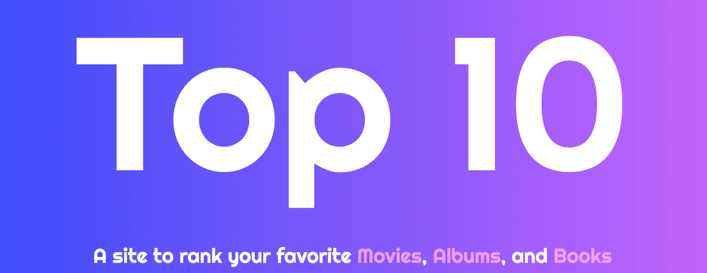

  # Top Ten

  

  ## Description
  Top Ten is a site to search, rank, and share your favorite movies, albums, and books. The app is built with React and Redux and item's names, image urls, and rank are stored in local storage to enable the content to persist. The Spotify API is used for the album search, IMDB API for movie search, and Google Books API for books search. The Spotify API requires two seperate calls, one for an OAuth token and the second for the search. After the token is recieved it is stored in state and any further search can be made with that token. After each search 10 items are stored in state for each category until the next search. On page load any items in local storage are added to the Redux store. At any point if content is added to the Redux store the items are reduced to a single string that can be shared via the home page on Facebook, Twitter, or Reddit!

  ## Usage
  Deployed Site:
  
  [Top Ten](https://top-ten.netlify.app/)
  ## Acknowledgements
  [React-Share](https://www.npmjs.com/package/react-share) was used to enable the social media sharing. The following APIs were used to enable the searchable content:
  * [Spotify](https://developer.spotify.com/documentation/web-api/) 
  * [IMDB](https://imdb-api.com/) 
  * [Google Books](https://developers.google.com/books/)
  
  ## Questions
  Github profile: [dgtlctzn](https://github.com/dgtlctzn)
  
  If you have any questions about the project please contact josephperry720@gmail.com
  ## License
  This project is covered under the GNU license
